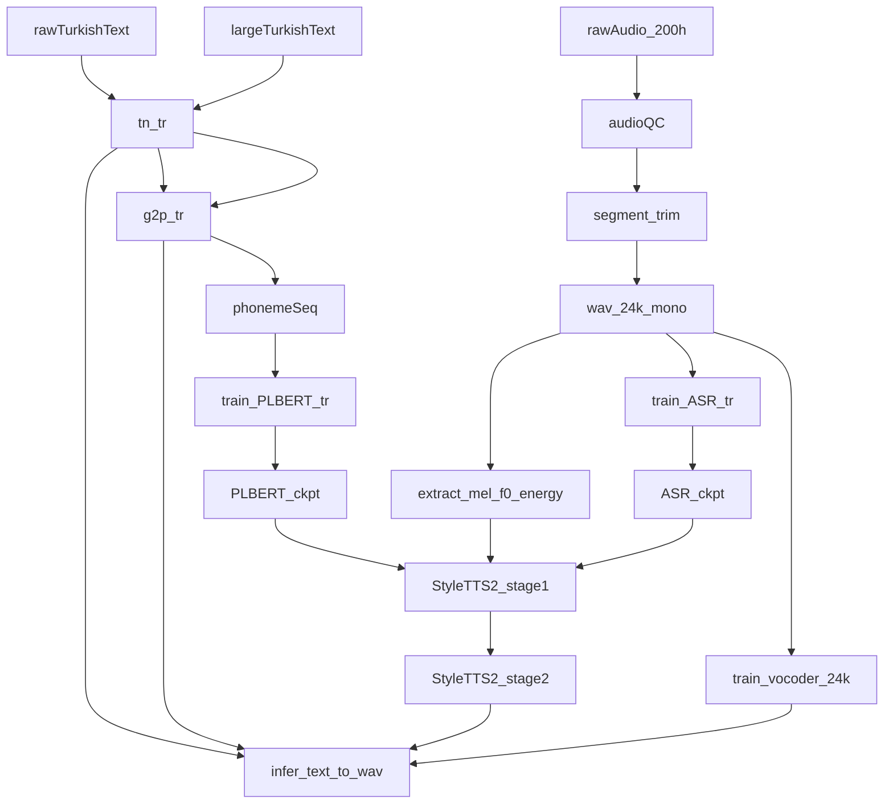

# StyleTTS2 Turkish Training (full from-scratch pipeline)

## Inputs and constraints

- **Compute**: 4× RTX 3090
- **Data**: ~200h Turkish, multi-speaker (5 speakers have >25h)
- **Requirement**: **No shortcuts** → we will train **Turkish PL‑BERT**, train a **Turkish ASR model** (to satisfy `ASR_path` usage / alignment / aux losses if present), train **StyleTTS2** end-to-end, and train a **matching 24kHz vocoder**.
- **Inference UX**: input is **raw Turkish text** → must ship **Turkish text normalization (TN) + G2P/phonemizer**.

## Why we include ASR + SSL-encoder validation

- The multilingual training questions in [issue #257](https://github.com/yl4579/StyleTTS2/issues/257) explicitly call out `ASR_path`, OOD text, and whether only “data + PL‑BERT” changes are enough. We will treat **ASR** and **text frontend** as first-class requirements.
- Non-English setups may require swapping the SSL encoder (users mention swapping WavLM↔HuBERT for Chinese in [issue #70](https://github.com/yl4579/StyleTTS2/issues/70)). We will add an early **A/B gate** to avoid discovering an encoder mismatch late.

## End-state architecture

## Phase 0 — Repo layout (after plan acceptance)

- Initialize `/home/ubuntu/styletts2-turkish-training` as your top-level project.
- Add upstream repos as submodules:
  - `yl4579/StyleTTS2`
  - `yl4579/PL-BERT`
  - `yl4579/AuxiliaryASR`
- Keep all Turkish-specific code/configs/scripts in `turkish_recipe/` so upstream updates don’t clobber local work.

## Phase 1 — Audit upstream code to lock exact requirements (must-do first)

After cloning, inspect upstream to answer with certainty:

- **ASR**: where `ASR_path` is used and what checkpoint format/architecture it expects (motivated by [issue #257](https://github.com/yl4579/StyleTTS2/issues/257)).
- **SSL encoder**: where WavLM is loaded and how embeddings are consumed (for swap feasibility per [issue #70](https://github.com/yl4579/StyleTTS2/issues/70)).
- **Training stages**: confirm whether training is multi-stage (`train_first.py` / `train_second.py` or equivalent).
- **Dataset manifest**: exact line format/fields (often `|`-separated), where speaker IDs live, and any optional language IDs.
- **Feature expectations**: which artifacts are required (mel/F0/energy/durations/alignments).
- **OOD text**: if `OOD_data` is used (as asked in [issue #257](https://github.com/yl4579/StyleTTS2/issues/257)), confirm format and training effect.

Deliverable: `turkish_recipe/notes/upstream_requirements.md` with concrete answers and file pointers.

## Phase 2 — Data engineering: audio + transcripts + splits (no shortcuts)

### 2.1 Canonical manifest

Create a single canonical manifest (then derive splits) that includes at least:

- `utt_id`
- `wav_path`
- `speaker_id`
- `text_raw`
- `text_normalized`
- `phonemes`
- optional QC metadata: duration, SNR, clipping flags, alignment confidence

### 2.2 Audio QC + standardization

- Resample to upstream SR (commonly 24kHz), mono.
- Loudness normalize (dataset-consistent target LUFS + peak ceiling).
- Trim leading/trailing silence; reject clips with excessive internal silence.
- Reject: clipped audio, strong noise/music/crosstalk, wrong language.
- Constrain durations (e.g. 1–15s unless upstream supports longer cleanly).

### 2.3 Splits

- `train` / `val` / `test_in_domain`: stratified per speaker.
- Optional `test_speaker_holdout`: hold out one non-critical speaker to measure generalization.

## Phase 3 — Turkish text normalization (TN) + G2P/phonemizer (inference-grade)

### 3.1 Turkish TN

Implement deterministic Turkish TN aligned with transcripts:

- Unicode normalization; punctuation + whitespace policy
- Expand numbers/dates/currency/times
- Abbreviations + units
- Correct Turkish casing/diacritics (İ/ı, Ğ/ğ, Ş/ş, etc.)

### 3.2 G2P/phonemizer

- Start with a robust baseline (e.g. espeak-ng Turkish) and post-process to a stable phoneme inventory.
- Build regression tests (~200 curated sentences) to keep TN+G2P stable.

## Phase 4 — Build a large Turkish phoneme corpus for PL‑BERT

- Do not rely only on 200h transcripts.
- Collect large Turkish text corpora (Wikipedia + public datasets).
- Run TN+G2P to create phoneme sequences.
- Produce:
  - `corpus_tr_phonemes.txt`
  - `token_maps.pkl` (phoneme → id)

## Phase 5 — Train Turkish PL‑BERT (masked LM on phoneme sequences)

- Confirm PL‑BERT repo’s expected vocab/token map format.
- Train with DDP + mixed precision + gradient accumulation.
- Use validation MLM loss/perplexity to choose best checkpoint (don’t rely only on step count).
- Export artifacts in a StyleTTS2-consumable layout, e.g.:
  - `turkish_recipe/assets/plbert_tr/config.yml`
  - `turkish_recipe/assets/plbert_tr/token_maps.pkl`
  - `turkish_recipe/assets/plbert_tr/step_XXXXXX.t7`
  - `turkish_recipe/assets/plbert_tr/util.py` (adapter if required)

## Phase 6 — Train Turkish ASR model (to satisfy `ASR_path` usage)

Because you want the full pipeline and [issue #257](https://github.com/yl4579/StyleTTS2/issues/257) raises ASR reuse questions:

- Start from a strong SSL backbone (Wav2Vec2/HuBERT/XLS-R style).
- Train/fine-tune on your 200h transcripts with speaker-balanced splits.
- Evaluate WER/CER and export a checkpoint that matches what upstream expects at `ASR_path`.

## Phase 7 — SSL encoder decision gate: WavLM vs HuBERT/XLS-R

Before long StyleTTS2 runs:

- Run an A/B evaluation on a representative Turkish dev set:
  - stability (no NaNs)
  - speaker separability (simple probe)
  - correlation with prosody (predict F0/energy)
- If WavLM underperforms, implement the swap to HuBERT/XLS-R in the encoder-loading module (motivated by non-English discussions in [issue #70](https://github.com/yl4579/StyleTTS2/issues/70)).

## Phase 8 — StyleTTS2 preprocessing (exactly per upstream)

After Phase 1 confirms details:

- Extract mel spectrograms with upstream mel params.
- Extract F0 and energy using upstream-consistent methods.
- If durations/alignments are required:
  - use the same method upstream uses
  - optionally run MFA as a QC signal even if not required (alignment confidence can catch transcript drift)
- Ensure any alignment/aux steps use **your Turkish ASR** where applicable.

## Phase 9 — Train StyleTTS2 (multi-speaker, staged)

- Create Turkish config(s) derived from upstream defaults, e.g. `turkish_recipe/configs/styletts2_tr_multispeaker.yml`.
- Stage 1: train the main acoustic alignment/text-to-acoustics components.
- Stage 2: adversarial/refinement (per upstream scripts).
- Keep batches speaker-balanced; keep fixed per-speaker validation sets.
- Validate with a fixed Turkish prompt list at checkpoints.

## Phase 10 — Train a matching 24kHz vocoder (no shortcuts)

- Train a vocoder compatible with StyleTTS2 on your cleaned 24kHz dataset.
- Use the exact same mel configuration as in Phase 8.
- Validate by listening tests + basic objective checks.

## Phase 11 — Package inference + acceptance tests

- Provide `infer.py` that loads:
  - Turkish TN+G2P
  - StyleTTS2 checkpoint
  - vocoder checkpoint
- Support single sentence + batch file inference; speaker selection.
- Provide a fixed acceptance test set covering Turkish edge cases (İ/ı, ğ, ş, suffixes, numbers).

## “Fully trained” gates (definition of done)

- **Data gates**: low reject rate after QC; low transcript mismatch; balanced speakers.
- **PL‑BERT gates**: stable val MLM loss; full phoneme vocab coverage; no exploding tokens.
- **ASR gates**: reasonable WER/CER on held-out; stable decoding on Turkish prompts.
- **TTS gates**: intelligibility on test; stable speaker identity; no systematic Turkish phoneme errors.
- **Vocoder gates**: no persistent noise/artifacts; stable loudness.

