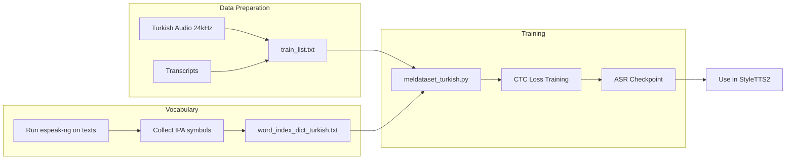

# Turkish AuxiliaryASR Training Plan

> Train AuxiliaryASR (phoneme-level CTC aligner) for Turkish by adapting the English-focused codebase to use espeak-ng Turkish phonemization, creating a Turkish IPA vocabulary, and training on 50-100+ hours of Turkish speech data.

## Tasks

- [x] Create turkish_recipe/auxasr/ directory structure and copy base files from AuxiliaryASR/
- [x] Run espeak-ng on Turkish text corpus to extract all IPA symbols and create word_index_dict_turkish.txt
- [x] Create meldataset_turkish.py with espeak-ng Turkish phonemizer replacing g2p_en
- [x] Create config_turkish.yml with correct n_token matching vocabulary size (115 tokens)
- [ ] Generate train_list.txt and val_list.txt from Turkish audio dataset (IN PROGRESS - 3 datasets)
- [ ] Test data loading on small subset to verify phonemization and vocabulary work correctly
- [ ] Train ASR model for 200 epochs on single GPU (no DDP)
- [ ] Evaluate WER on validation set and export checkpoint for StyleTTS2 integration

## Datasets Being Processed

1. **omersaidd/tts_nisan_kumru_tur** - 8,042 samples (COMPLETE)
2. **omersaidd/tts_mazlum_kiper_tur** - 9,643 samples (IN PROGRESS)
3. **Anilosan15/Turkish_TTS_Data** - 30,606 samples (PENDING)

**Total**: ~48,291 samples across 3 speakers

---

## Background

AuxiliaryASR is a phoneme-level ASR model used for text-mel alignment in StyleTTS/StyleTTS2. The existing codebase is English-only (uses `g2p_en`). We need to adapt it for Turkish.

## Training Data Requirements

### Format
Each line in `train_list.txt` and `val_list.txt`:
```
path/to/audio.wav|raw text transcript|speaker_id
```

Example:
```
turkish_data/utt001.wav|Merhaba dünya nasılsınız|0
turkish_data/utt002.wav|Bugün hava çok güzel|0
```

### Audio Specs (from config.yml)
- Sample rate: **24kHz**
- Format: WAV, mono
- Duration: 1-15 seconds per utterance recommended

### Data Quantity (from GitHub issues)
- **160+ hours**: Comparable quality to original LibriTTS-trained model
- **50-100 hours**: Good quality, recommended minimum for Turkish
- **20 hours**: ~45% WER at epoch 200, still learning
- **<10 hours**: Risk of phoneme repetition artifacts

**Recommendation**: Use 50-100 hours from your 200h dataset for ASR training.

## Code Modifications Required

### 1. Phonemizer Replacement

**File**: `meldataset.py` lines 17, 56, 85-88

Current (English):
```python
from g2p_en import G2p
self.g2p = G2p()
ps = self.g2p(text.replace('-', ' '))
```

Replace with (Turkish):
```python
from phonemizer import phonemize

# In _load_tensor():
ps = phonemize(
    text,
    language='tr',
    backend='espeak',
    strip=True,
    preserve_punctuation=True
).split()
```

### 2. Turkish Vocabulary

**File**: Create `word_index_dict_turkish.txt`

Based on espeak-ng Turkish IPA output. Structure:
```csv
"<pad>",0
"<sos>",1
"<eos>",2
"<unk>",3
" ",4
",",5
".",6
...IPA symbols...
```

Reference: Your existing `turkish_recipe/plbert/data/phoneme_chars.txt` contains ~100 IPA symbols from Turkish data.

### 3. Config Update

**File**: Create `config_turkish.yml`

Key change - update `n_token` to match vocabulary size:
```yaml
model_params:
   n_token: 120  # adjust to actual Turkish vocab size
```

## Key Insights from GitHub Issues

1. **No DDP**: Issue #16 confirms distributed training causes phoneme repetition. Use single GPU or DataParallel only.

2. **No tones in vocab**: Issue #2 (Mandarin) - tones/pitch handled by F0 model, not ASR.

3. **Fine-grained phonemes**: Use character-level IPA (e.g., `m ɛ ɾ h a b a`), not syllables.

4. **Batch size**: 64 uses ~10GB VRAM per GPU.

## Directory Structure

```
turkish_recipe/auxasr/
├── Configs/
│   └── config_turkish.yml
├── Data/
│   ├── train_list.txt
│   ├── val_list.txt
│   └── word_index_dict_turkish.txt
├── meldataset_turkish.py
├── text_utils_turkish.py
├── train_turkish.py
├── models.py              # copy from original
├── layers.py              # copy from original
├── trainer.py             # copy from original
├── utils.py               # copy from original
├── optimizers.py          # copy from original
└── Checkpoint/            # training output
```

## Training Parameters

- **Epochs**: 200 (standard)
- **Batch size**: 64 (fits in 10GB VRAM)
- **Learning rate**: 0.0005 (default)
- **Validation frequency**: Every 10 epochs

## Data Pipeline



## Verification

After training, validate with:
- **WER/PER** on held-out set (target: <30%)
- **Manual inspection** of predicted vs expected phonemes
- **Integration test** with StyleTTS2 alignment

## References

- [AuxiliaryASR GitHub](https://github.com/yl4579/AuxiliaryASR)
- Issue #2: Mandarin training insights
- Issue #8: phonemizer usage
- Issue #16: espeak phonemizer and data quantity requirements
- StyleTTS2 Issue #325: Turkish training guidance
